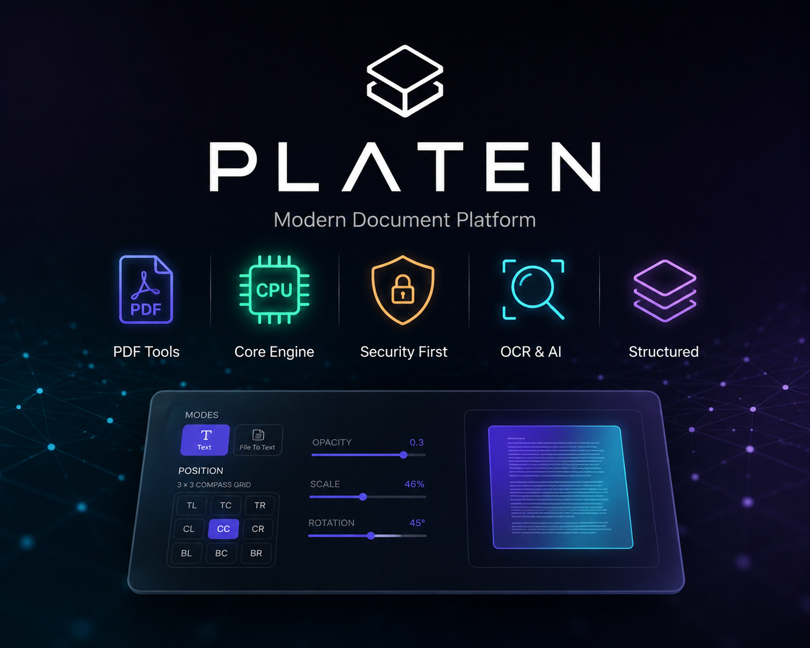

# PDFNest

PDFNest is a Next.js PDF workspace for browsing tools, uploading documents, previewing PDFs in the browser, and sending processing requests to the PDFNest backend. The app includes a shared tool layout, per-tool workspaces, a download step for completed files, and a studio-style editor for advanced PDF workflows.

## What the app includes

- Tool pages under `app/(site)/[toolId]`
- A shared tool layout that loads remote tool configuration and renders SEO and FAQ helpers
- A workspace step for the active tool
- A download screen for completed outputs
- A studio area for more advanced editing flows
- Admin pages for platform content and tool configuration
- Auth, Google login, and Paddle subscription integration
- A lightweight proxy route for lock requests

## Main user flows

Most tools follow the same pattern:

1. Open a tool page.
2. Upload a file or enter the required input.
3. Continue to the workspace for the selected tool.
4. Run the operation.
5. Go to the download page and save the finished file.

The shared tool layout fetches the active tool configuration from the backend, then renders `ToolSEO` before the page content and `ToolFAQ` after it. fileciteturn23file0L10-L14 fileciteturn26file0L37-L40 fileciteturn27file0L24-L44

## Features

- Merge multiple PDFs into one document
- Split PDFs by selected pages
- Rotate, reorder, crop, duplicate, and delete PDF pages
- Insert blank pages
- Add text overlays, watermarks, page numbers, signatures, highlights, underlines, and strikeouts
- Repair damaged PDFs
- Compress and grayscale PDFs
- Edit PDF metadata
- Lock, unlock, and redact PDFs
- Convert images to PDF
- Convert PDF pages to images
- Convert Office documents and code to PDF
- Convert URLs and Markdown to PDF
- Extract text from PDFs
- Work with a studio editor for advanced document manipulation
- Support light and dark theme modes

## Tech stack

- Next.js 16 App Router
- React 19
- TypeScript
- Tailwind CSS 4
- pdfjs-dist for client-side PDF previews
- @dnd-kit for drag-and-drop page ordering
- lucide-react icons
- Recharts for admin analytics and dashboard charts
- Paddle for subscriptions
- Google login support

## Requirements

- Node.js 20 or newer
- npm, pnpm, yarn, or bun
- A running PDFNest backend API
- A running PDFNest worker service for worker-backed tools

The frontend reads its backend base URL from `NEXT_PUBLIC_API_URL`. The example environment files use `http://localhost:8080` for local development and the Render backend URL for production. fileciteturn22file0L28-L45

## Environment variables

Common frontend variables:

- `NEXT_PUBLIC_API_URL`
- `NEXT_PUBLIC_APP_URL`
- `NEXT_PUBLIC_GOOGLE_CLIENT_ID`
- `NEXT_PUBLIC_PADDLE_CLIENT_TOKEN`
- `NEXT_PUBLIC_PADDLE_ENV`

A sample local setup can look like this:

```bash
NEXT_PUBLIC_API_URL=http://localhost:8080
NEXT_PUBLIC_APP_URL=http://localhost:3000
NEXT_PUBLIC_GOOGLE_CLIENT_ID=your-google-client-id
NEXT_PUBLIC_PADDLE_CLIENT_TOKEN=your-paddle-token
NEXT_PUBLIC_PADDLE_ENV=sandbox
```

## Getting started

Install dependencies:

```bash
npm install
```

Create `.env.local` if needed and add the variables above.

Start the development server:

```bash
npm run dev
```

Open `http://localhost:3000` in your browser.

## Available scripts

```bash
npm run dev
```

Starts the local development server.

```bash
npm run build
```

Builds the app for production.

```bash
npm run start
```

Starts the production server after a successful build.

```bash
npm run lint
```

Runs ESLint.

## Project structure

```text
app/                  App Router pages and route handlers
components/           Shared UI components
components/pdf/       PDF upload, preview, layout, and action components
components/studio/    Studio editor components and tools
components/admin/     Admin content editor components
context/              Auth context and shared state
hooks/                Studio and job-related hooks
lib/                  API client, tool metadata, SEO, and error helpers
public/               Static assets and PDF.js worker
```

The current tree includes shared tool routes, download pages, workspace pages, a studio area, admin content editors, and a lock proxy route. fileciteturn25file0L129-L179

## Important routes

- `app/(site)/[toolId]/page.tsx` — shared tool landing page
- `app/(site)/[toolId]/workspace/page.tsx` — workspace for the selected tool
- `app/(site)/[toolId]/download/page.tsx` — download screen for the processed file
- `app/studio/page.tsx` — studio editor entry
- `app/(site)/admin/page.tsx` — admin dashboard
- `app/(site)/admin/content/page.tsx` — content and tool configuration editor
- `app/(site)/api/lock/route.ts` — Next.js proxy for lock requests

## Backend integration

The frontend uses `lib/api.ts` to send `FormData` requests to the backend and receive processed files back. The current app expects endpoints for structure, optimization, security, conversion, OCR, edit, and markup flows. The markup flow now uses job submission, progress polling, and download endpoints. fileciteturn24file0L100-L121 fileciteturn17file8L1020-L1051 fileciteturn20file2L232-L239

## Adding a tool

1. Add the page under `app/(site)/[toolId]/page.tsx` or the matching workspace component.
2. Add or update the navigation entry in `lib/toolsData.ts`.
3. Reuse the shared PDF components in `components/pdf/` when possible.
4. Keep the tool configuration in sync with the backend content source and admin editor.

## Notes

- The app uses a shared tool layout that loads backend tool metadata and falls back to local tool data when needed.
- Studio tools are split into reusable components under `components/studio/tools/`.
- Admin pages can edit home content, subscription matrices, about content, and workspace configuration.
- The frontend is designed to work with the separate Go backend and worker service rather than local Python scripts.

## License

This project is licensed under the terms in [LICENSE](./LICENSE).
