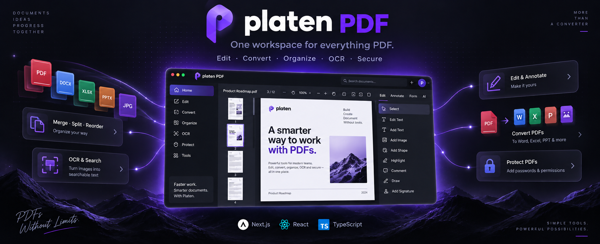

# Platen PDF

## Overview

Platen PDF is a Next.js PDF workspace for browsing tools, uploading documents, previewing PDFs in the browser, and sending processing requests to the Platen PDF backend. The app includes a shared tool layout, per‑tool workspaces, a download step for completed files, and a studio‑style editor for advanced PDF workflows.

## Features

- **Organize**: Merge PDFs, split PDFs, rotate pages, delete pages, reorder pages, insert blank pages.
- **Edit**: Add watermarks, page numbers, edit PDF metadata, redact text, apply signatures.
- **Optimize**: Compress PDFs, convert to grayscale.
- **Create**: Convert images to PDF, PDF to images, PDF to Office formats, URL to PDF, Markdown to PDF, code to PDF, OCR to searchable PDF.
- **Security**: Protect (lock) PDFs, unlock PDFs, redaction.
- **Studio**: Advanced editor for complex document manipulation.

## Tech Stack

- Next.js 16 (App Router)
- React 19
- TypeScript
- Tailwind CSS 4
- pdfjs‑dist for client‑side PDF previews
- @dnd-kit for drag‑and‑drop page ordering
- lucide‑react icons
- Recharts for admin analytics and dashboard charts
- Paddle for subscriptions
- Google login support

## Requirements

- Node.js 20 or newer
- npm, pnpm, yarn, or bun
- A running Platen PDF backend API (`NEXT_PUBLIC_API_URL`)
- A running Platen PDF worker service (`NEXT_PUBLIC_WORKER_URL` if applicable)

## Environment Variables

- `NEXT_PUBLIC_API_URL`
- `NEXT_PUBLIC_APP_URL`
- `NEXT_PUBLIC_GOOGLE_CLIENT_ID`
- `NEXT_PUBLIC_PADDLE_CLIENT_TOKEN`
- `NEXT_PUBLIC_PADDLE_ENV`

## Getting Started

```bash
npm install            # install dependencies
cp .env.example .env.local   # copy sample env file and edit values as needed
npm run dev            # start development server
```

Open `http://localhost:3000` in your browser.

## Available Scripts

```bash
npm run dev      # Start the local development server
npm run build    # Build the app for production
npm run start    # Start the production server after a successful build
npm run lint     # Run ESLint
```

## Project Structure

```text
app/                  App Router pages and route handlers
components/           Shared UI components
components/pdf/       PDF upload, preview, layout, and action components
components/studio/    Studio editor components and tools
components/admin/     Admin content editor components
context/              Auth context and shared state
hooks/                Studio and job‑related hooks
lib/                  API client, tool metadata, SEO, and error helpers
public/               Static assets and PDF.js worker
```

## Important Routes

- `app/(site)/[toolId]/page.tsx` – shared tool landing page
- `app/(site)/[toolId]/workspace/page.tsx` – workspace for the selected tool
- `app/(site)/[toolId]/download/page.tsx` – download screen for processed file
- `app/studio/page.tsx` – studio editor entry
- `app/(site)/admin/page.tsx` – admin dashboard
- `app/(site)/admin/content/page.tsx` – content and tool configuration editor
- `app/(site)/api/lock/route.ts` – Next.js proxy for lock requests

## Backend Integration

The frontend uses `lib/api.ts` to send `FormData` requests to the Platen PDF backend and receive processed files back. The current app expects endpoints for structure, optimization, security, conversion, OCR, edit, and markup flows.

## Adding a Tool

1. Add the page under `app/(site)/[toolId]/page.tsx` or the matching workspace component.
2. Update the navigation entry in `lib/toolsData.ts`.
3. Reuse shared PDF components in `components/pdf/` where possible.
4. Keep the tool configuration in sync with the backend content source and admin editor.

## Notes

- The app uses a shared tool layout that loads backend tool metadata and falls back to local tool data when needed.
- Studio tools are split into reusable components under `components/studio/tools/`.
- Admin pages can edit home content, subscription matrices, about content, and workspace configuration.
- The frontend is designed to work with the separate Go backend and FastAPI worker service rather than local Python scripts.

## License

This project is licensed under the terms in [LICENSE](./LICENSE).
