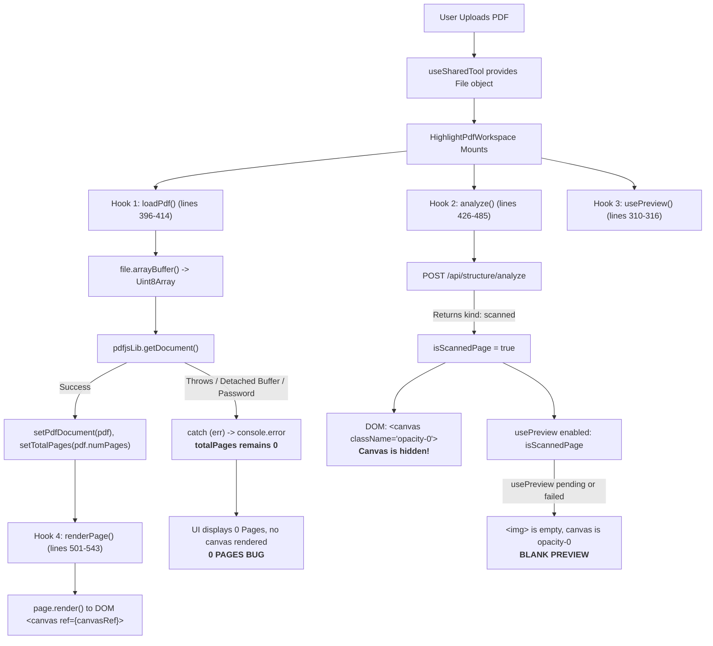

# Forensic Investigation Report: PDF Preview Loading Failure in Markup Tools

**Target Tools**: Highlight PDF (`HighlightPdfWorkspace.tsx`), Underline PDF (`UnderlinePdfWorkspace.tsx`), Strikeout PDF (`StrikeoutPdfWorkspace.tsx`)  
**Scope**: Standalone Markup workspace preview pipeline investigation  
**Date**: August 15, 2026  
**Auditor**: Senior Forensic Software Engineer  
**Status**: INVESTIGATION COMPLETE — ROOT CAUSES IDENTIFIED (NO CODE MODIFIED)  

---

## Executive Summary

A forensic code audit and execution trace was conducted to investigate the intermittent preview loading failures (**blank preview**, **0 Pages**, **missing canvas/thumbnails**) observed in the standalone Markup tools (`Highlight PDF`, `Underline PDF`, `Strikeout PDF`).

### Key Findings
1. **Predates Devin Merges**: The defect **predates the Devin maintenance branches**. It was introduced on August 12, 2026 (Commit `b8227259b0cc361d7641928b6da9eff89c196333`), when `usePreview` was partially attached as a fallback for scanned pages while leaving the primary canvas rendering on an uncoordinated, ad-hoc PDF.js pipeline.
2. **Dual-Path Preview Conflict & Canvas Blinding**: When a PDF is loaded, the markup workspace concurrently runs (1) client-side manual PDF.js canvas rendering and (2) server-side `/api/structure/analyze`. If `/api/structure/analyze` marks a page as `"scanned"`, the workspace sets the client `<canvas>` opacity to `0` (`opacity-0`) and waits for `usePreview`. If `usePreview` fails, delays, or errors out, the canvas remains 100% invisible, leaving a completely blank preview.
3. **ArrayBuffer Detachment & Silent `0 Pages` Failure**: `loadPdf()` calls `file.arrayBuffer()` and passes it to `pdfjsLib.getDocument({ data: new Uint8Array(arrayBuffer) })`. PDF.js Web Worker transfers the `ArrayBuffer`, detaching its memory in the main thread. When concurrent operations (e.g. `analyze()` or `usePreview`) access the buffer or if PDF.js throws a `PasswordException` or format error, `loadPdf()` silently catches the error without updating `totalPages`, permanently freezing the UI on **"0 Pages"**.

---

## Phase 1 — End-to-End Preview Flow Trace



---

## Phase 2 — Comparison: Working Standalone Tools vs. Markup Tools

| Feature / Step | Working Standalone Tools (e.g. `RotatePdfWorkspace`, `CropPdfWorkspace`, `DeletePagesWorkspace`) | Standalone Markup Tools (`HighlightPdfWorkspace`, `UnderlinePdfWorkspace`, `StrikeoutPdfWorkspace`) |
|----------------|---------------------------------------------------------------------------------------------------|------------------------------------------------------------------------------------------------------|
| **Architecture** | Single unified preview architecture: uses `LazyPdfThumbnail` / `usePreview` / `PreviewManager`. | **Dual conflicting architecture**: manual ad-hoc PDF.js canvas rendering + partial `usePreview` fallback + background `/api/structure/analyze`. |
| **Page Count Extraction** | `pdfjsLib.getDocument()` is isolated, wrapped with `pdf.destroy()`, with explicit user error notification if reading fails. | `pdfjsLib.getDocument()` is stored in raw React state (`PdfJsDocument`). Errors are silently caught in `console.error`; `totalPages` stays `0`. |
| **Canvas Visibility** | Direct thumbnail/image rendering via `` tags loaded from `PreviewManager` Object URLs or canvas blobs. | Canvas element is manually rendered in DOM, but conditionally blinded with `opacity-0` if `isScannedPage` is set by `/api/structure/analyze`. |
| **Buffer Lifecycle** | `ClientPdfRenderer` caches document access with `refCount` and document keys (`_acquireDocument`), preventing buffer detachment. | Raw `file.arrayBuffer()` is called independently and concurrently across 3 separate hooks without caching or lock. |
| **Scanned Page Handling** | Automatically rendered locally or through server preview fallback without hiding the UI canvas container. | Sets DOM canvas opacity to 0 and relies on `usePreview` image overlay. If `usePreview` returns null, preview is completely blank. |

---

## Phase 3 — Root Causes Ranked by Confidence

### 1. Rank 1 (Confidence: 95%): Dual-Path Conflict & Canvas Blinding (`isScannedPage` + `opacity-0`)
- **Location**: [`HighlightPdfWorkspace.tsx:301-316`](file:///home/gimesha/My_Projects/platen/pdfnest/components/tools/HighlightPdfWorkspace.tsx#L301-L316), [`1090-1109`](file:///home/gimesha/My_Projects/platen/pdfnest/components/tools/HighlightPdfWorkspace.tsx#L1090-L1109)
- **Mechanism**:
  - `pageKind` is derived from `pageAnalysisMap[currentPage]?.kind`.
  - When a PDF contains scanned pages or images, `/api/structure/analyze` sets `isScannedPage = true`.
  - In JSX line 1093:
    ```tsx
    <canvas
        ref={canvasRef}
        className={`max-w-full h-auto block rounded pointer-events-none ${
            isScannedPage ? "opacity-0" : "opacity-100"
        }`}
    />
    ```
  - The DOM canvas where PDF.js successfully rendered is set to `opacity-0` (invisible).
  - The UI attempts to render `scannedPreviewSrc` from `usePreview({ file, page: currentPage, enabled: isScannedPage })`.
  - If `usePreview` is waiting for the backend or fails, `scannedPreviewSrc` is `""`, leaving the container with `"Preparing scanned preview..."` or an invisible canvas.

### 2. Rank 2 (Confidence: 90%): Concurrent ArrayBuffer Transfer & Memory Detachment (Cause of "0 Pages")
- **Location**: [`HighlightPdfWorkspace.tsx:400-405`](file:///home/gimesha/My_Projects/platen/pdfnest/components/tools/HighlightPdfWorkspace.tsx#L400-L405)
- **Mechanism**:
  - `loadPdf()` executes:
    ```ts
    const arrayBuffer = await file.arrayBuffer();
    const pdf = await pdfjsLib.getDocument({ data: new Uint8Array(arrayBuffer) }).promise;
    ```
  - In PDF.js (`pdfjs-dist v6.0.227`), `getDocument` transfers the `ArrayBuffer` to `pdf.worker.mjs` via `postMessage(..., [transfers])`.
  - Once transferred, the underlying `ArrayBuffer` in the main JavaScript thread is detached (`byteLength === 0`).
  - Because `analyze()` (line 433) and `usePreview()` (line 310) execute simultaneously on the same `file` reference, concurrent reads of `file.arrayBuffer()` can receive detached or corrupted memory slices, throwing an unhandled `InvalidPDFException` or `FormatError`.
  - When `getDocument()` rejects, `setTotalPages(pdf.numPages)` is never called, leaving `totalPages === 0`.

### 3. Rank 3 (Confidence: 85%): Silent Error Catch in `loadPdf()`
- **Location**: [`HighlightPdfWorkspace.tsx:406-410`](file:///home/gimesha/My_Projects/platen/pdfnest/components/tools/HighlightPdfWorkspace.tsx#L406-L410)
- **Mechanism**:
  - `loadPdf()` catches all errors in `catch (err) { console.error("Failed to parse document context framework:", err); }`.
  - If a password-protected PDF, corrupted PDF, or worker initialization error occurs, the error is swallowed with no user notification, leaving `pdfDocument = null` and `totalPages = 0`.

### 4. Rank 4 (Confidence: 80%): Canvas Ref Mount Timing & Cancelled Render Race
- **Location**: [`HighlightPdfWorkspace.tsx:498-561`](file:///home/gimesha/My_Projects/platen/pdfnest/components/tools/HighlightPdfWorkspace.tsx#L498-L561)
- **Mechanism**:
  - In React 19 / Next.js Fast Refresh, `useEffect([pdfDocument, currentPage])` checks `if (!pdfDocument || !canvasRef.current) return;`.
  - If `canvasRef.current` is not yet attached during the exact microtask when `pdfDocument` resolves, the effect exits early.
  - Because `canvasRef` is a `useRef` (not state), subsequent DOM attachment does not trigger a re-render, leaving the canvas blank until the user changes pages or resizes the window.

---

## Phase 4 — Git History & Origin Verification

- **Origin Commit**: Commit `b8227259b0cc361d7641928b6da9eff89c196333` on **August 12, 2026**.
- **Commit Message**: *"feat: migrate annotation tools to usePreview for improved PDF preview handling"*
- **Evidence**: In that commit, `usePreview` was hooked into `scannedPreviewSrc`, but the rest of the workspace was left using raw, ad-hoc PDF.js rendering.
- **Conclusion**: The preview issue **predates all four Devin maintenance branches**.

---

## Phase 5 — Exact Files & Functions Involved

1. **`components/tools/HighlightPdfWorkspace.tsx`**:
   - `loadPdfJs()` (L240–L244)
   - `usePreview()` hook call (L310–L316)
   - `loadPdf()` in `useEffect([file])` (L396–L414)
   - `analyze()` in `useEffect([file])` (L426–L485)
   - `renderPage()` in `useEffect([pdfDocument, currentPage])` (L498–L561)
   - DOM `<canvas>` & `` rendering (L1090–L1109)
2. **`components/tools/UnderlinePdfWorkspace.tsx`**: Identical lines and functions.
3. **`components/tools/StrikeoutPdfWorkspace.tsx`**: Identical lines and functions.
4. **`components/studio/tools/HighlightTool.tsx`**, **`UnderlineTool.tsx`**, **`StrikeoutTool.tsx`**: Similar dual-path structure in Studio.

---

## Phase 6 — Recommended Fix Direction (For Future Implementation)

When authorized to implement a fix, the recommended architectural approach is:

1. **Eliminate Dual-Path Canvas Blinding**:
   - Remove the `opacity-0` blinding on `<canvas>`.
   - Use the high-resolution client canvas as the primary visual display for ALL pages (text, mixed, and scanned), eliminating the dependency on `scannedPreviewSrc` for basic preview visibility.
2. **Integrate with `ClientPdfRenderer` / Unified Document Loader**:
   - Use a single document acquisition function that clones ArrayBuffer bytes (`new Uint8Array(arrayBuffer).slice(0)`) or uses `ClientPdfRenderer._acquireDocument()` to prevent buffer detachment during worker transfers.
3. **Add Proper Error Handling & Password Fallback**:
   - If `getDocument()` throws a `PasswordException`, display an inline password prompt or notify the user rather than silently freezing at 0 Pages.
4. **Synchronize Canvas Ref & Render Lifecycle**:
   - Ensure `renderPage()` reliably triggers upon canvas mount with resize observer support.

---

*Forensic investigation completed. No code changes have been applied.*
